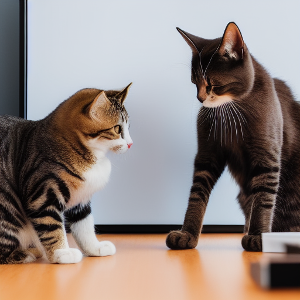

### Approach

Experience the transformative power of expert leadership from a seasoned senior software engineer turned consultant. With nearly two decades of experience in the agency and consulting world, I understand the urgency of value delivery in software development. I also recognize the critical role that psychological safety and open communication play in achieving exceptional outcomes. Through a blend of proven frameworks and a deep understanding of remote dynamics, I empower your teams to thrive, ensuring project success and safeguarding your reputation.

### My Services

1. **Navigating Remote Challenges:** I understand the unique challenges faced by remote software teams. Whether it's maintaining productivity, fostering team cohesion, or managing distributed workflows, I have the firsthand experience to navigate these obstacles. By leveraging technology, proven methodologies, and a deep understanding of remote work dynamics, I empower your teams to overcome challenges and excel in a distributed environment.

2. **Foster Psychological Safety:** Create an environment of trust and psychological safety within your remote software teams. By assessing the team's current dynamics, I employ a range of frameworks and strategies, including liberating structures, to encourage open and constructive conversations. This approach nurtures a culture of collaboration, where team members feel comfortable expressing ideas, sharing concerns, and engaging in meaningful discussions.

3. **Accelerate Value Delivery:** Drawing from my extensive background in software development, I recognize the urgency of timely value delivery. My approach is tailored to the unique challenges of remote environments, ensuring that your projects stay on track. By cultivating open lines of communication and facilitating efficient decision-making, I help your teams maintain momentum, overcome obstacles, and achieve successful outcomes.

4. **Collective Storytelling for Alignment and Engagement:** The power of storytelling cannot be underestimated. We facilitate a process where teams collaboratively create their narrative, grounded in facts, data-insights, and their firsthand experiences. This collective storytelling approach fosters alignment, encourages engagement, and strengthens team cohesion. By empowering teams to craft and share their own story, they develop a sense of ownership and purpose, driving motivation and inspiring innovative solutions.

5. **Strategic Alignment through Wardley Mapping:** Wardley Mapping is a powerful tool for strategic alignment in the software industry. By visualizing the landscape of your business and mapping out the evolution of components and dependencies, we help your teams gain clarity on where to innovate, where to borrow, and where to focus their efforts. This strategic alignment ensures that your remote software teams are working in concert towards a shared vision, maximizing value delivery and market impact.

6. **Domain Driven Design for Market-Value and Technical Innovation:** To truly drive innovation, it is crucial to bridge the gap between market value and technical capabilities. By incorporating Domain Driven Design principles, we enable leadership to understand the intricate interactions between business domains, technical architecture, and market dynamics. This holistic perspective empowers your teams to make strategic decisions that align with market needs, driving innovation, and positioning your organization for sustainable growth.

Ready to empower your remote software teams to embrace their collective story and thrive in a changing market? Let's connect today and explore how my expertise as an experienced senior software engineer, coupled with my passion for leadership, can make a significant impact on your organization. Contact me and take the first step towards empowering your remote teams for success.

---

Copyright &copy; {{ site.time | date: '%Y' }} Kraus Dev House

